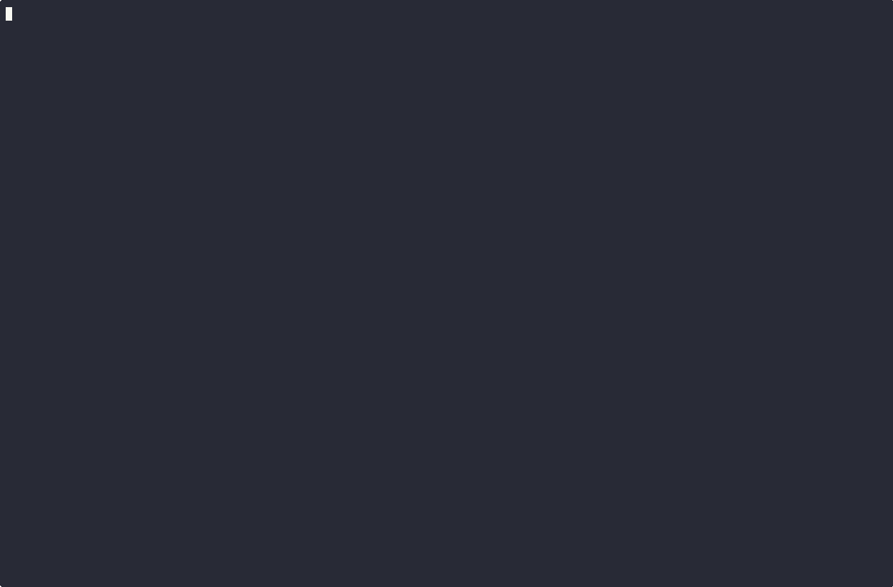

# 🌐 TGate

**A beautiful HTTP proxy tool that exposes local services through Tailscale with comprehensive request logging and monitoring.**

TGate combines the power of Tailscale's secure networking with an elegant terminal user interface for real-time request monitoring. Perfect for development, debugging, and sharing local services securely.

## ✨ Features

- 🔒 **Secure Tailscale Integration** - Expose local services through your private Tailscale network
- 🌍 **Funnel Support** - Share services publicly on the internet with Tailscale Funnel
- 🎨 **Beautiful TUI** - Real-time monitoring with a split-pane interface showing logs and request details
- 📝 **Comprehensive Logging** - Detailed request/response logging with headers, body, and timing
- 🔐 **HTTPS Support** - Automatic TLS certificate provisioning through Tailscale
- ⚡ **Dual Mode** - Works with local Tailscale daemon or as a standalone tsnet device
- 🛠 **Developer Friendly** - Perfect for debugging webhooks, APIs, and local development



## 🚀 Installation

### Homebrew (macOS/Linux)

```bash
# Add the tap
brew tap jaxxstorm/tap

# Install tgate
brew install tgate
```

### Pre-built Binaries

Download the latest release for your platform from the [GitHub Releases](https://github.com/jaxxstorm/tgate/releases) page.

#### Linux
```bash
# Download and extract (replace with latest version and your platform)
curl -L https://github.com/jaxxstorm/tgate/releases/download/v0.1.0/tgate-v0.1.0-linux-amd64.tar.gz | tar xz

# Make executable and move to PATH
chmod +x tgate
sudo mv tgate /usr/local/bin/
```

#### MacOS

```
brew install jaxxstorm/tap/tgate
```

#### Windows
Download the `.zip` file from releases and extract `tgate.exe` to a directory in your PATH.

### From Source

```bash
# Clone the repository
git clone https://github.com/jaxxstorm/tgate.git
cd tgate

# Install dependencies
go mod tidy

# Build
go build -o tgate main.go

# Install to PATH (optional)
sudo mv tgate /usr/local/bin/
```

## 🏃 Quick Start

### Verify Installation

```bash
# Check version
tgate --version

# View help
tgate --help
```

### Basic Usage

```bash
# Expose a local service running on port 8080
tgate 8080

# Enable Tailscale Funnel (public internet access)
tgate 8080 --funnel

# Use legacy console output instead of TUI
tgate 8080 --no-tui

# Verbose logging
tgate 8080 --funnel --verbose
```

## 📖 Usage Examples

### Expose a Local Web Server

```bash
# Start your local development server
python -m http.server 8080

# In another terminal, expose it through Tailscale
tgate 8080
```

### Share a Local API Publicly

```bash
# Expose your local API to the internet
tgate 3000 --funnel
```

### Debug Webhook Endpoints

```bash
# Create a public endpoint for webhook testing
tgate 4000 --funnel --verbose
```

### Custom Configuration

```bash
# Use HTTPS on a custom port with a specific path
tgate 8080 --use-https --serve-port 8443 --set-path /api

# Force tsnet mode with custom node name
tgate 8080 --force-tsnet --tailscale-name my-proxy-node
```

## 🎛 Command Line Options

| Flag | Short | Description | Default |
|------|-------|-------------|---------|
| `PORT` | - | Local port to expose (required) | - |
| `--version` | - | Show version information | - |
| `--tailscale-name` | `-n` | Tailscale node name (tsnet mode only) | `tgate` |
| `--funnel` | `-f` | Enable Tailscale funnel (public internet) | `false` |
| `--verbose` | `-v` | Enable verbose logging | `false` |
| `--json` | `-j` | Output logs in JSON format | `false` |
| `--no-tui` | - | Disable TUI, use console output | `false` |
| `--log-file` | - | Write logs to file | - |
| `--auth-key` | - | Tailscale auth key for tsnet mode | - |
| `--force-tsnet` | - | Force tsnet mode | `false` |
| `--set-path` | - | Custom serve path | `/` |
| `--serve-port` | - | Tailscale serve port | `80`/`443` |
| `--use-https` | - | Use HTTPS (auto-enabled with --funnel) | `false` |

## 🎨 Terminal User Interface

TGate features a beautiful split-pane TUI built with [Charm](https://charm.sh) libraries:

### Left Pane: Application Logs
- Real-time application status and configuration logs
- Color-coded log levels (INFO, WARN, ERROR)
- Startup information and connection status
- Scrollable history with timestamps

### Right Pane: Request Monitor
- Latest HTTP request details
- Request method, URL, and status code
- Response timing and size information
- Complete request and response headers
- Request body (for POST/PUT requests)
- Color-coded status indicators

### Controls
- `q` or `Ctrl+C` to quit
- Automatic scrolling and window resizing
- Up/Down arrows to scroll through content

## 🔧 Configuration

### Prerequisites

1. **Install Tailscale** on your machine:
   ```bash
   # macOS
   brew install tailscale
   
   # Linux (Ubuntu/Debian)
   curl -fsSL https://tailscale.com/install.sh | sh
   
   # Windows
   # Download from https://tailscale.com/download
   ```

2. **Authenticate with Tailscale**:
   ```bash
   sudo tailscale up
   ```

3. **Enable HTTPS certificates** (for --funnel or --use-https):
   - Go to https://login.tailscale.com/admin/dns
   - Enable "HTTPS Certificates"
   - Wait 2-3 minutes for certificate provisioning

### Operating Modes

#### Local Tailscale Mode (Default)
Uses your existing Tailscale installation:
```bash
tgate 8080 --funnel
```

#### TSNet Mode
Creates a separate Tailscale device:
```bash
# Interactive authentication
tgate 8080 --force-tsnet

# With auth key
tgate 8080 --auth-key tskey-auth-xxxxx
```

## 🌍 Tailscale Funnel

Tailscale Funnel allows you to expose services to the public internet:

```bash
# Enable funnel (automatically enables HTTPS)
tgate 8080 --funnel
```

**Requirements:**
- HTTPS certificates enabled in Tailscale admin console
- Port 443 (automatically configured)
- Valid Tailscale subscription with Funnel access

## 📝 Logging

### TUI Mode (Default)
- Real-time visual interface with separate panes
- Color-coded request/response information
- Automatic log rotation (last 1000 requests)

### Console Mode
```bash
tgate 8080 --no-tui
```

### File Logging
```bash
tgate 8080 --log-file /tmp/tgate.log
```

### JSON Format
```bash
tgate 8080 --json --log-file /tmp/tgate.json
```

## 🛠 Development

### Prerequisites
- Go 1.19+
- Tailscale installed and authenticated

### Building from Source
```bash
# Clone the repository
git clone https://github.com/jaxxstorm/tgate.git
cd tgate

# Install dependencies
go mod tidy

# Build
go build -o tgate main.go

# Run
./tgate 8080
```

### Dependencies
- [Kong](https://github.com/alecthomas/kong) - CLI parsing
- [Zap](https://go.uber.org/zap) - Structured logging
- [Tailscale](https://tailscale.com) - Networking and certificates
- [Bubble Tea](https://github.com/charmbracelet/bubbletea) - TUI framework
- [Lipgloss](https://github.com/charmbracelet/lipgloss) - TUI styling

### Release Process

This project uses [GoReleaser](https://goreleaser.com/) for automated releases:

```bash
# Tag a new version
git tag v0.1.0
git push origin v0.1.0

# GoReleaser will automatically:
# - Build binaries for all platforms
# - Create GitHub release
# - Update Homebrew tap
```

## 🎯 Use Cases

### Development
- Expose local development servers to team members
- Test webhooks from external services
- Debug API integrations with remote services

### Demo & Sharing
- Share local prototypes instantly
- Demo applications without deployment
- Temporary public access for testing

### Debugging
- Monitor HTTP traffic in real-time
- Inspect headers and request bodies
- Debug timing and performance issues
- Test different client configurations

## 🔒 Security

TGate leverages Tailscale's security model:

- **Private by default** - Only accessible within your Tailscale network
- **End-to-end encryption** - All traffic is encrypted
- **Zero-config certificates** - Automatic TLS certificate management
- **Access controls** - Leverage Tailscale's ACL system
- **Audit logs** - All requests are logged for monitoring

## 📜 License

MIT License - see LICENSE file for details.

## 🤝 Contributing

Contributions welcome! Please feel free to submit a Pull Request.

## 🐛 Troubleshooting

### Installation Issues
```bash
# Verify installation
tgate --version

# Check if Tailscale is installed and running
tailscale status
```

### TUI Hangs or Doesn't Display
```bash
# Use console mode instead
tgate 8080 --no-tui --funnel
```

### HTTPS Certificate Issues
```bash
# Check if HTTPS is enabled in Tailscale admin
# Wait 2-3 minutes after enabling certificates
# Try HTTP first to test connectivity
tgate 8080  # Without --funnel or --use-https
```

### Port Already in Use
```bash
# Reset Tailscale serve configuration
tailscale serve reset

# Or use a different serve port
tgate 8080 --serve-port 8443
```

### Connection Issues
```bash
# Verify local service is running
curl localhost:8080

# Check Tailscale status
tailscale status

# Enable verbose logging
tgate 8080 --verbose
```

---

**Made with ❤️ for the Tailscale community**
- `q` or `Ctrl+C` to quit
- Automatic scrolling and window resizing
- Up/Down arrows to scroll through content

## 🔧 Configuration

### Tailscale Setup

1. **Install Tailscale** on your machine
2. **Enable HTTPS certificates** (for --funnel or --use-https):
   - Go to https://login.tailscale.com/admin/dns
   - Enable "HTTPS Certificates"
   - Wait 2-3 minutes for certificate provisioning

### Operating Modes

#### Local Tailscale Mode (Default)
Uses your existing Tailscale installation:
```bash
./tgate 8080 --funnel
```

#### TSNet Mode
Creates a separate Tailscale device:
```bash
# Interactive authentication
./tgate 8080 --force-tsnet

# With auth key
./tgate 8080 --auth-key tskey-auth-xxxxx
```

## 🌍 Tailscale Funnel

Tailscale Funnel allows you to expose services to the public internet:

```bash
# Enable funnel (automatically enables HTTPS)
./tgate 8080 --funnel
```

**Requirements:**
- HTTPS certificates enabled in Tailscale admin console
- Port 443 (automatically configured)
- Valid Tailscale subscription with Funnel access

## 📝 Logging

### TUI Mode (Default)
- Real-time visual interface with separate panes
- Color-coded request/response information
- Automatic log rotation (last 1000 requests)

### Console Mode
```bash
./tgate 8080 --no-tui
```

### File Logging
```bash
./tgate 8080 --log-file /tmp/tgate.log
```

### JSON Format
```bash
./tgate 8080 --json --log-file /tmp/tgate.json
```

## 🛠 Development

### Prerequisites
- Go 1.19+
- Tailscale installed and authenticated

### Building
```bash
go build -o tgate main.go
```

### Dependencies
- [Kong](https://github.com/alecthomas/kong) - CLI parsing
- [Zap](https://go.uber.org/zap) - Structured logging
- [Tailscale](https://tailscale.com) - Networking and certificates
- [Bubble Tea](https://github.com/charmbracelet/bubbletea) - TUI framework
- [Lipgloss](https://github.com/charmbracelet/lipgloss) - TUI styling

## 🎯 Use Cases

### Development
- Expose local development servers to team members
- Test webhooks from external services
- Debug API integrations with remote services

### Demo & Sharing
- Share local prototypes instantly
- Demo applications without deployment
- Temporary public access for testing

### Debugging
- Monitor HTTP traffic in real-time
- Inspect headers and request bodies
- Debug timing and performance issues
- Test different client configurations

## 🔒 Security

TGate leverages Tailscale's security model:

- **Private by default** - Only accessible within your Tailscale network
- **End-to-end encryption** - All traffic is encrypted
- **Zero-config certificates** - Automatic TLS certificate management
- **Access controls** - Leverage Tailscale's ACL system
- **Audit logs** - All requests are logged for monitoring

## 📜 License

MIT License - see LICENSE file for details.

## 🤝 Contributing

Contributions welcome! Please feel free to submit a Pull Request.

## 🐛 Troubleshooting

### TUI Hangs or Doesn't Display
```bash
# Use console mode instead
./tgate 8080 --no-tui --funnel
```

### HTTPS Certificate Issues
```bash
# Check if HTTPS is enabled in Tailscale admin
# Wait 2-3 minutes after enabling certificates
# Try HTTP first to test connectivity
./tgate 8080  # Without --funnel or --use-https
```

### Port Already in Use
```bash
# Reset Tailscale serve configuration
tailscale serve reset

# Or use a different serve port
./tgate 8080 --serve-port 8443
```

### Connection Issues
```bash
# Verify local service is running
curl localhost:8080

# Check Tailscale status
tailscale status

# Enable verbose logging
./tgate 8080 --verbose
```

---

**Made with ❤️ for the Tailscale community**